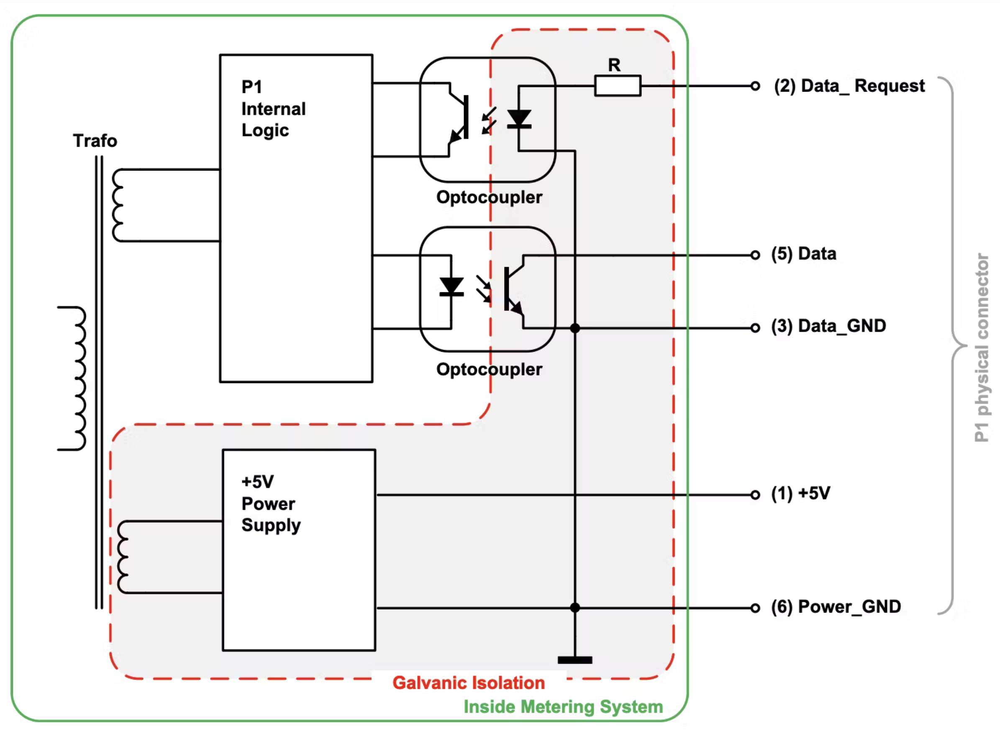
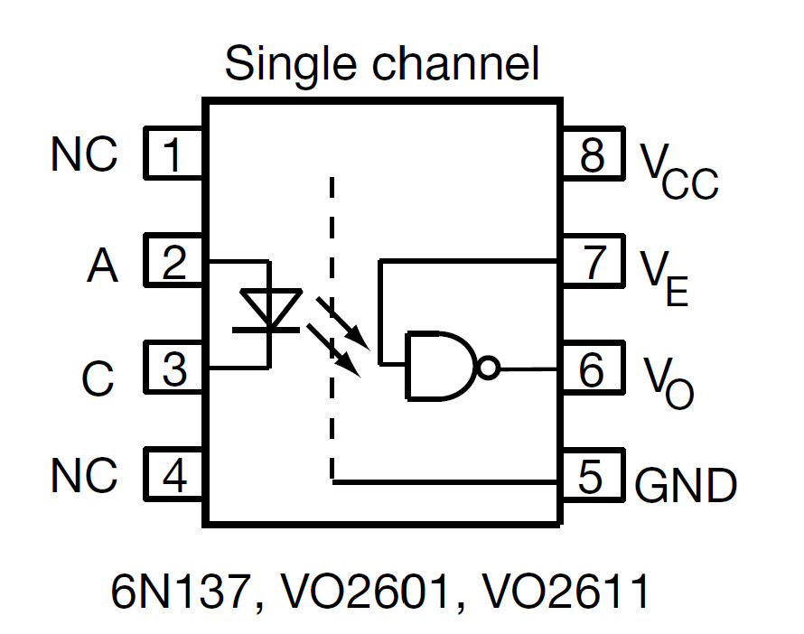

# P1-slimme-meter-extender
Extending the range for a P1 slimmer meter connection and even making it possible to connect multiple receiver (having their own data enable)/
***

The inside of the P1 communication part.

See also 
[Wiki P1-poort](https://nl.wikipedia.org/wiki/P1-poort) and [DSMR P1 Companion Standard 5.0.2](https://www.netbeheernederland.nl/publicatie/dsmr-502-p1-companion-standard)
***
Multiple nethods are being used to "extend" the range or to have multiple "P1 outputs".

## Lowering the pull up resistor at the pin (5)Data:
* Making the rising edge "faster" and in so compensating the higher load. 
* It can work for your situation, but you never now how good it is.

## Using a driver:

* With a driver, you actively drive the output High and Low.
* This means that you can driver a higher load or have  "faster" rising and falling edges
* Keep in mind that this is not an open collector solution anymore.

* It is claimed that this solution does extend the range 10 times, but in reality it only makes it possible to add more "drive strength" to the signal, resulting in a better signal for the receiver also after adding extra meters to the cabling.
## Using differential signals

* [Differential signalling](https://en.wikipedia.org/wiki/Differential_signalling)
* Common-mode noise is easily rejected by a differential receiver.
* Longer cable runs are possible due to the increased noise immunity.
* Use of an output that can drive a higher load

### Work in Progress...