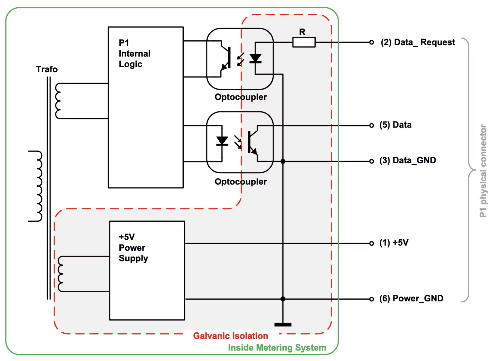
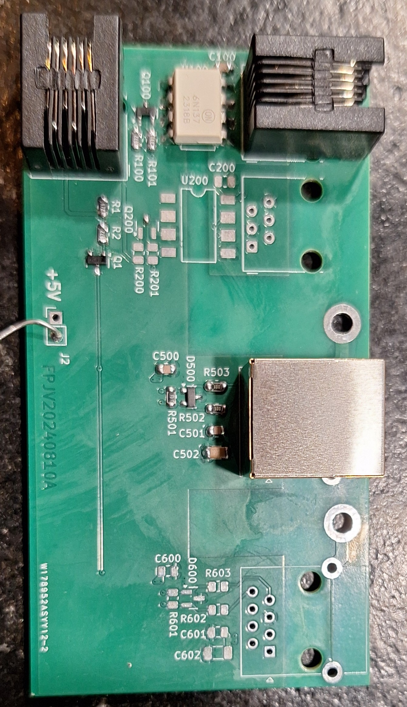
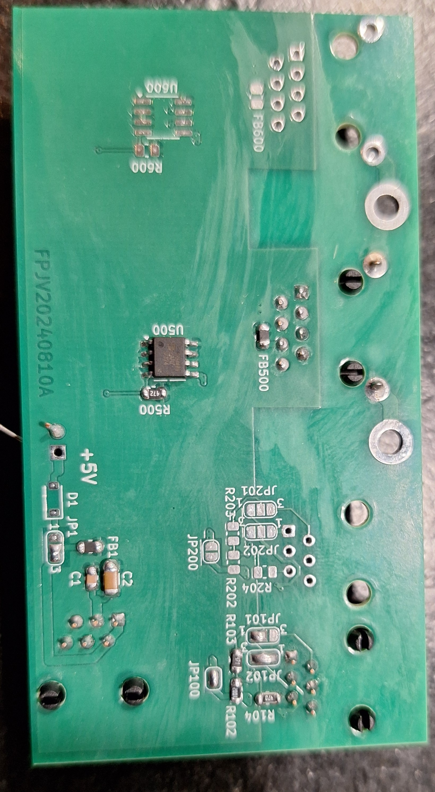
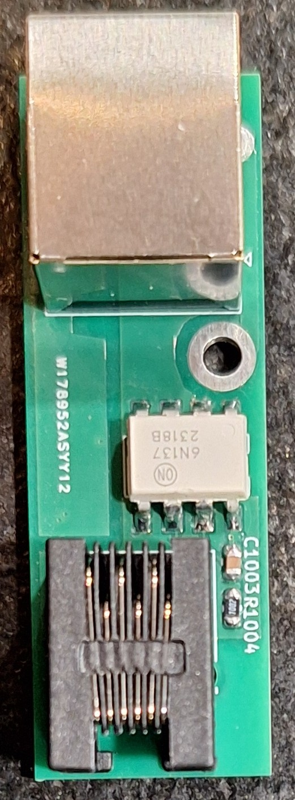
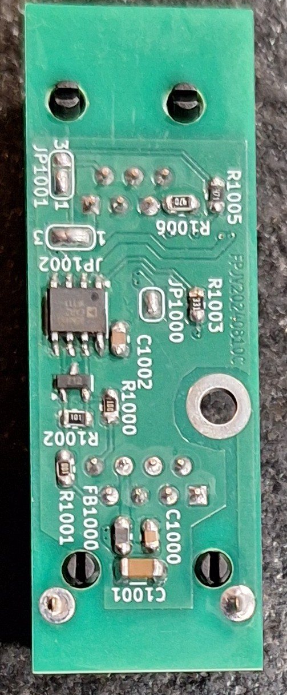

# P1-slimme-meter-extender
Extending the range for a P1 slimmer meter connection and even making it possible to connect multiple receivers (having their own data enable).
***

The inside of the P1 communication part.

See also 
[Wiki P1-poort](https://nl.wikipedia.org/wiki/P1-poort) and [DSMR P1 Companion Standard 5.0.2](https://www.netbeheernederland.nl/publicatie/dsmr-502-p1-companion-standard)
***
The schematic shows the extension of the Smartmeter P1 port to
* 2 (isolated) P1 outputs
* 2 P1 output extenders (RS485) to multiple meters
* Multiple options for isolation and power

See also the Kicad directory for the project and schematic
[Schematic](Kicad/P1SmartMeter.pdf)

The schematic can be extended to more P1 output or more P1 extenders

Images of the Main part, top and back

Images of the extender receiving part, top and back

